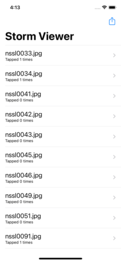

# 100-Days-Of-Swift
Solutions to Paul Hudson's "100 days of Swift" projects and challenges

https://www.hackingwithswift.com/100

## Completion status

Type                | Number  | Completion
:---                |  :---:  |   :---:
Projects            | 0 / 30 | 0%
Challenges          | 0 / 90 | 0%
Milestone Projects  | 0 / 10 | 0%
Core Graphics redux | 0 / 1  | 100%

## Notes
- This is 100 days of **Swift**. For 100 days of **SwiftUI**, look [here](https://github.com/VaishantMakan/100-Days-Of-SwiftUI).

## Preview

*Within each project are larger versions of the screenshots.*

Projects / Topics                                                                                                                                                            | Screenshots
---                                                                                                                                                                          |---
[Project 1](01-Project1) - *Storm Viewer*  (with challenges)                                           View controllers, Storyboard, FileManager                                |   |
                                                                                   
